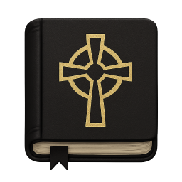
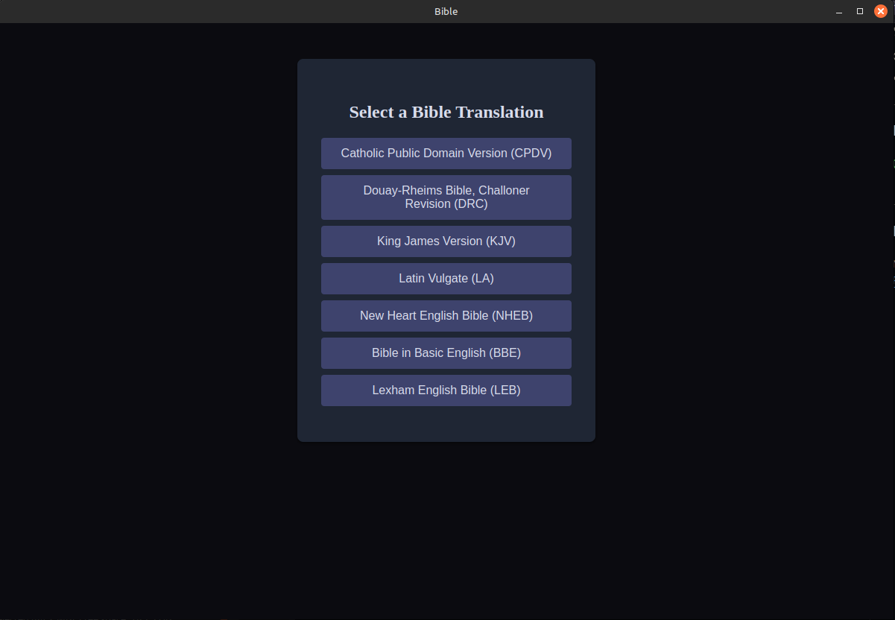
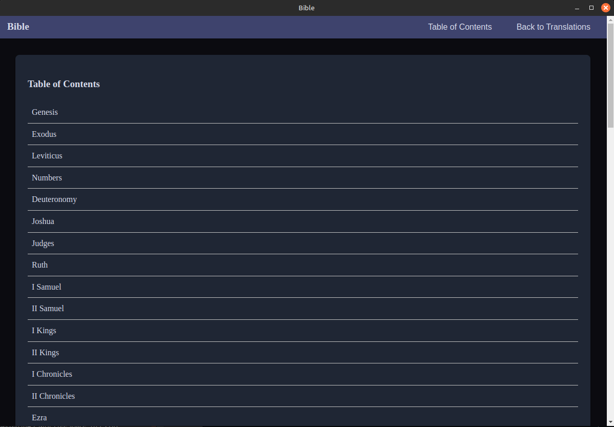
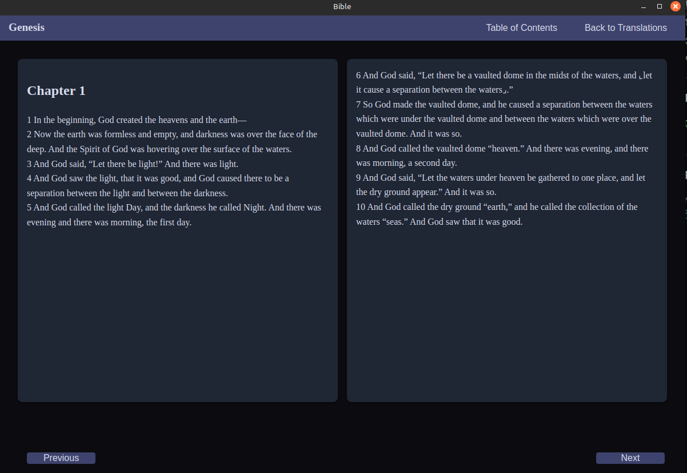

# Bible App

A simple, clean, and modern desktop application for focused Bible study and reading.

## About The Project

The goal of this app is to provide a simple and distraction-free experience for reading and studying the Word of God. It is built with web technologies and packaged as a cross-platform desktop application using Electron. This app will be packaged along with three other apps of my making in a Christian-themed linux distro that I plan to release soon.

## Features

* **Multiple Translations:** Easily switch between different Bible translations:
  - Catholic Public Domain Version (CPDV)
  - Douay-Rheims Bible, Challoner Revision (DRC)
  - King James Version (KJV)
  - Latin Vulgate (LA)
  - New Heart English Bible (NHEB)
  - Bible in Basic English (BBE)
  - Lexham English Bible (LEB)
* **Table of Contents:** Quickly find verses across the entire Bible.
* **Clean Interface:** A simple UI designed for reading and focus.

## Built With

*   [Electron.js](https://www.electronjs.org/)
*   [Node.js](https://nodejs.org/)
*   [SQLite3](https://www.sqlite.org/index.html)

## Download
[Download Latest Release](https://github.com/Bighairymtnman/Bible/releases/latest)

## Screenshots

## Bible Data

All Bible data has been obtained from here: https://github.com/scrollmapper/bible_databases/tree/master

## License

© 2025 Andrew Nicastro. All rights reserved.

This application is provided as-is for personal use. Redistribution, repackaging, or commercial use is strictly prohibited without explicit written permission from the author.
